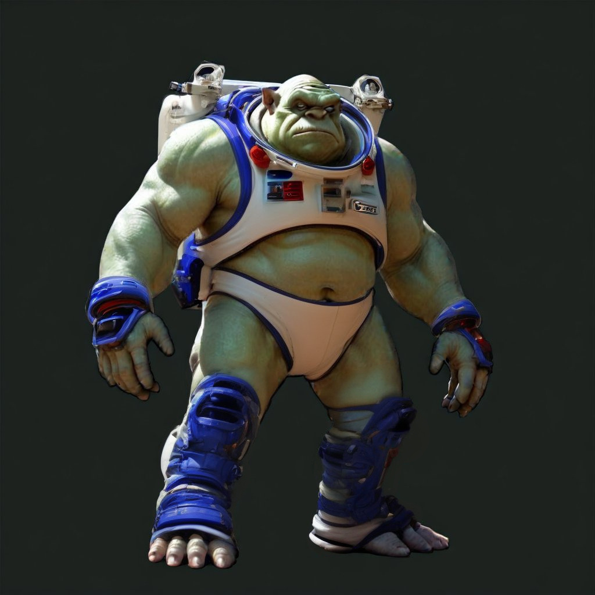

# **LoadOrderManager**  
*by ZeeOgre*



## Description

This application is designed to help you manage your LoadOrders in Starfield. Right now, the game is sometimes randomly changing load orders, and sometimes you just want a different set of mods depending on what you're doing.

This app introduces GroupSets and LoadOuts to facilitate loading and running the game the way you want quickly.

This uses a very small, highly normalized SQLite database to keep track of all your enabled Plugins.

It introduces a new formatting style for the `Plugins.txt` file to facilitate easy sharing.

## Acquisition

The application is available at [https://github.com/ZeeOgre/ZO.LoadOrderManager](https://github.com/ZeeOgre/ZO.LoadOrderManager), autoupdate coming soon.

## Prerequisites

This is a .NET 8.0 application running WPF. It's targeted for x64 Windows 10, 22H2 — the same as the minimum requirements for Starfield. Although it **may** run on lower versions (I haven't had a 32-bit machine to test on in a while). In "full debug mode," it'll run a little over 400 MB of RAM, and the "Full Debug" distribution is about 113 MB (you may need more for libraries).

## Getting Started

Once you've installed the program, it needs to know only one thing: "Where's my Starfield at!"  
The installer should ask you along the way, but if you don't set it there, you should be prompted to find it on first launch.

In the starting state, a dummy `config.yaml` will be copied to `%USERAPPDATA%\ZeeOgre\LoadOrderManager`. This two-line file contains the info about the path to Starfield and the autoupdate flag.

Make sure to fill in the folder where your Starfield is installed. (If you're a Steam player, it should be under `SteamLibrary\steamapps\common\Starfield`, and if you're an Xbox GamePass player, you'll find it at `Games\Starfield\Content` (or wherever you store your Xbox library).

If the installer worked, you shouldn't see this, but we have a tiny 160 KB file to get you started.
]
For now, don't worry about monitored files; they'll come in with the database — we set up monitors for `Plugins.txt`, `Starfield.ccc` (even though we don't do anything with it yet), and `ContentCatalog.txt`. You can easily add or remove more if you need.

For your first start though, click on the folder, find the Starfield game folder (if you're a Steam player, it should be under `..\SteamLibrary\steamapps\common\Starfield`, and if you're an Xbox GamePass player, you'll find it at `..\Games\Starfield\Content` (or wherever you store your Xbox library).

If you've deleted and reinstalled, and remember where your "good yaml" is, you can also just load straight from that.

Hit save, and it'll restart. 

The first time you start, by default, it's going to start in my "Sample Set" that I've built for you.

It will have also pulled in all your existing mods and populated more detailed information from your `ContentCatalog.txt`.

At release, you have to restart the app one more time though to see them.

So after you restart:
]
- Your plugins will come in with all the data from ContentCatalog in a human-readable form.
- Double-click on any of them for more details:
]
This only works right for demo purposes, because I've already built our handy-dandy custom `Plugins.txt`.  
Oh... wait... yeah... we've got a built-in diff viewer so you can see exactly what's changed... cool, huh!


```
Here's the skeleton:
# plugins.txt produced by ZeeOgre's LoadOutManager using Group Set ZeeOgre's Sample and profile ZeeOgre's Default on 2024-10-14 19:12:29
##------------------------------------------------------------------------------------------------------------------------------------------##

### BethesdaPaid @@ Bethesda paid mods

### Community Patch @@ https://starfieldpatch.dev

### Places @@ New and furnished locations

### New Things @@ Objects, Followers, etc..

#### Followers @@ People, critters and bots that will follow you around

#### Items @@ Added Clothing, Armor, Items

#### New Ships @@ Ships

#### Vehicles @@ The REV-8 Buggy and its related changes

### Gameplay Modification @@ Mods which change game behavior, but you might want to still override some of the things that happen here.

### High Priority Mods @@ Mods which should never be changed except by deliberate choice

#### DarkStar @@ Darkstar by Wykkyd Gaming

#### Shipbuilding @@ Habs, ship-related mods, etc

### High Priority Overrides @@ These mods are known to make changes that may override other mods and should be loaded after everything else.

### ForcedOverrides @@ Deliberate override choices which you never want to be overridden by anything else

### ESP @@ ESP files - these are generally "in development" mods and should always be loaded last.

### In Development @@ Specific Non-development mods. Generally best to be loaded very late to make sure there are no conflicts.

# End of plugins.txt
```

Bethesda uses `#` to mark comments in the `Plugins.txt` file, so you can just save this as your `plugins.txt` file, and the game will happily read it and use it, with the plugins in the order you place them here.

I mark **GROUPS** with three # marks -- `### Group Name @@ Group Description`.  
I indicate the hierarchy (groups can contain plugins and/or other groups) by adding `#` to indicate depth, and then you reset to the previous level by going one # less.

So in our example above, Darkstar and Shipbuilding are children of High Priority Mods.

As normal, ✔ indicates that it's enabled; no ✔, not enabled.

Now here's why this app exists... every time you enter a game with a commented-up `plugins.txt`, the game strips all the comments out!

As long as you're happy with your order, hey, all good, you don't need to reimport anything. BUT, lately the game has been changing this on you -- which is where the diffviewer and filemonitor come into play. Leave it open, and get a popup when the game changes it on you, and put it back right away if you want.

But that's where our Uncategorized group comes into play. This is your library of mods that you haven't added to anything, but they were discovered — usually through the `ContentCatalog.txt`.

If you deleted the sample out, had a vanilla `plugins.txt` and loaded fresh, everything on your system would be in "Default Root," and you'd pretty much be looking at it the way it stands in your `plugins.txt`.

You might have some uncategorized if you have things that you've brought in through your mod manager that didn't update plugins, or if they're in `ContentCatalog`, but not in your plugins.

So, say you don't like my groups (hey, it's fine, I'll get over it) and you want to build your own custom hierarchy...that's a **GROUPSET**

]
GREAT, go for it!! The easiest way is to set a new favorite and use the `ImportFiles` command — it'll scan your game folder for `.esm`s and `.esp`s, it'll build your groups as you've defined them in your `plugins.txt`, and it'll have at least the one Default LoadOut.

I give you some samples to work with on some of the different ways I play — as always YMMV.

"But Zee... why oh why am I downloading your crap when I can just edit my plugins with notepad and have different things saved?"

Fair point, and considering the in-game process as well as most of the ones built in to mod managers, you're right, they suck... but mostly because they can't **MULTISELECT**.
]


Whaaaat's that... pick and choose multiple items to move at once?? Yes, please!!

You want to swap a whole category at once?

You can't remember where you last saw a plugin.

New Loadouts can go in from here or direct from the edit window, name it, save it, and mark it as favorite for the groupset, and when you start the program, it'll start with your new groupset and new loadout by default.


### Known Bugs and Issues

1. Search should work when you hit enter or click search —.
2. Can't re-import plugins and have them just add from `plugins.txt`, but you **can** from file scan and from `ContentCatalog`.
3. If you want your right-click menu to work right, you have to left-click on an item before you start, and then wait just a tick until you see the up/down buttons change.
4. The initial loadup requires you to restart the app to see your plugins.
5. There's an `.ini` file in the game folder where you can turn debug output on and off... it can get noisy.
6. If you use shift-click to multiselect, enjoy it while it lasts; it only works **one** time — as soon as you do a move/change group, it's back to CTRL-clicking for you.
7. Spacebar does not toggle the checkbox.
8. LoadOut switching doesn't always update the UI well; the little green light in the corner tells you if the data is there and should be good — right click on it and hit refresh, and it'll **usually** update.

I look forward to seeing y'all at [https://github.com/ZeeOgre/ZO.LoadOrderManager](https://github.com/ZeeOgre/ZO.LoadOrderManager) if you have questions/comments/concerns!
